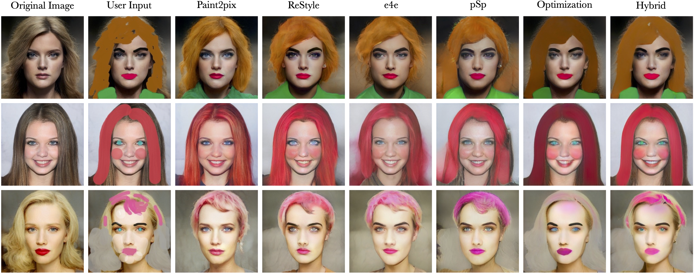
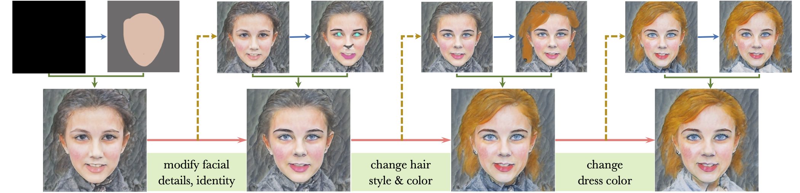

# Paint2Pix: Interactive Painting based Progressive Image Synthesis and Editing (ECCV 2022)

> Controllable image synthesis with user scribbles is a topic of keen interest in the computer vision community. In this paper, for the first time we study the problem of photorealistic image synthesis from incomplete and primitive human paintings. In particular, we propose a novel approach paint2pix, which learns to predict (and adapt) “what a user wants to draw” from rudimentary brushstroke inputs, by learning a mapping from the manifold of incomplete human paintings to their realistic renderings. When used in conjunction with recent works in autonomous painting agents, we show that paint2pix can be used for progressive image synthesis from scratch. During this process, paint2pix allows a novice user to progressively synthesize the desired image output, while requiring just few coarse user scribbles to accurately steer the trajectory of the synthesis process. Furthermore, we find that our approach also forms a surprisingly convenient approach for real image editing, and allows the user to perform a diverse range of custom fine-grained edits through the addition of only a few well-placed  brushstrokes.

<p align="center">
  
<br>
We propose <em>paint2pix</em> which helps the user directly express his/her ideas in visual form by learning to predict user-intention from a few rudimentary brushstrokes. The proposed approach can be used for (a) synthesizing a desired image output directly from scratch 
wherein it allows the user to control the overall synthesis trajectory using just few coarse brushstrokes (blue arrows) at key points,
or, (b) performing a diverse range of custom edits directly on real image inputs.
</p>

## Description   
Official implementation of our Paint2pix paper with streamlit demo. By using autonomous painting agents as a proxy for the human painting process, Paint2pix learns to predict *user-intention* ("what a user wants to draw") from fairly rudimentary paintings and user-scribbles.

## Table of Contents
- [Getting Started](#getting-started)
  * [Prerequisites](#prerequisites)
  * [Installation](#installation)
- [Pretrained Models](#pretrained-models)
  * [Paint2pix models](#paint2pix-models)
- [Using the Demo](#using-the-demo)
- [Example Results](#example-results)
  * [Progressive Image Synthesis](#progressive-image-synthesis)
  * [Real Image Editing](#real-image-editing)
  * [Artistic Content Generation](#artistic-content-generation)
- [Acknowledgments](#acknowledgments)
- [Citation](#citation)

<small><i><a href='http://ecotrust-canada.github.io/markdown-toc/'>Table of contents generated with markdown-toc</a></i></small>


## Getting Started
### Prerequisites
- Linux or macOS
- NVIDIA GPU + CUDA CuDNN (CPU may be possible with some modifications, but is not inherently supported)
- Python 3
- Tested on Ubuntu 20.04, Nvidia RTX 3090 and CUDA 11.5

### Installation
- Dependencies:  
We recommend running this repository using [Anaconda](https://docs.anaconda.com/anaconda/install/). 
All dependencies for defining the environment are provided in `environment/paint2pix_env.yaml`.

## Pretrained Models
Please download the following pretrained models essential for running the provided demo.

### Paint2pix models
| Path | Description
| :--- | :----------
|[Canvas Encoder - ReStyle](https://drive.google.com/file/d/1ufKEtDXEG6o96KjLh-i6EL7Ir9TlwPcs/view?usp=sharing)  | Paint2pix Canvas Encoder trained with a ReStyle architecture.
|[Identity Encoder - ReStyle](https://drive.google.com/file/d/1KT3YmSHgMJM3b7Ox9zciyo3FSELtJsyS/view?usp=sharing)  | Paint2pix Identity Encoder trained with a ReStyle architecture.
|[StyleGAN - Watercolor Painting](https://drive.google.com/file/d/1KT3YmSHgMJM3b7Ox9zciyo3FSELtJsyS/view?usp=sharing)  | StyleGAN decoder network trained to generate watercolor paintings. Used for artistic content generation with paint2pix.
|[IR-SE50 Model](https://drive.google.com/file/d/1U4q_o20uGMozSetOkMGddUcAWf_ons2-/view?usp=sharing) | Pretrained IR-SE50 model taken from [TreB1eN](https://github.com/TreB1eN/InsightFace_Pytorch) for use in ID loss and id-encoder training.


Please download and save the above models to the directory `pretrained_models`. 


## Using the Demo

We provide a streamlit-drawble canvas based demo for trying out different features of the Paint2pix model. To start the demo use,

```
CUDA_VISIBLE_DEVICES=2 streamlit run demo.py --server.port 6009
```

The demo can then be accessed on the local machine or ssh client via [localhost](http://localhost:6009).

The demo has been divided into 3 convenient sections:
    
1. **Real Image Editing**: Allows the user to edit real images using coarse user scribbles
2. **Progressive Image Synthesis**: Start from an empty canvas and design your desired image output using just coarse scribbles.
3. **Artistic Content Generation**: Unleash your inner artist! create highly artistic portraits using just coarse scribbles.


## Example Results

### Progressive Image Synthesis

<p align="center">
  
<br>
Paint2pix for progressive image synthesis
</p>

### Real Image Editing

<p align="center">
  
<br>
Paint2pix for achieving diverse custom real-image edits
</p>

### Artistic Content Generation


<p align="center">
  
<br>
Paint2pix for generating highly artistic content using coarse scribbles
</p>

## Acknowledgments
This code borrows heavily from [pixel2style2pixel](https://github.com/eladrich/pixel2style2pixel), 
[encoder4editing](https://github.com/omertov/encoder4editing) and [restyle-encoder](https://github.com/yuval-alaluf/restyle-encoder). 

## Citation
If you use this code for your research, please cite the following works:
```
@inproceedings{singh2022paint2pix,
  title={Paint2Pix: Interactive Painting based Progressive
        Image Synthesis and Editing},
  author={Singh, Jaskirat and Zheng, Liang and Smith, Cameron and Echevarria, Jose},
  booktitle={European conference on computer vision},
  year={2022},
  organization={Springer}
}
```
```
@inproceedings{singh2022intelli,
  title={Intelli-Paint: Towards Developing Human-like Painting Agents},
  author={Singh, Jaskirat and Smith, Cameron and Echevarria, Jose and Zheng, Liang},
  booktitle={European conference on computer vision},
  year={2022},
  organization={Springer}
}
```

